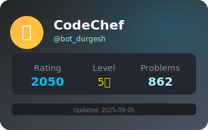

<!-- <p align="center"></p>  -->


       
<div style=" font-size: medium; color: #447ff7" align=center>  

                                 
  
 
<!-- Enhanced animated header with gradient mesh background -->

<p align="center">
  
</p>


<!-- Typing SVG animation with custom name and roles -->
<div style = "margin-top: 60px; margin-bottom: 60px"> 

<p align="center">
  
</p>

</div>
<!-- Alternative with more dynamic animation -->
<!-- 
<p align="center">

</p> -->


<!-- Glowing divider -->

<p align="center">
             
</p>

<!-- Modern glass-morphism style badges -->

<p align="center">
  
  
  
</p>


<div style = "margin-top: 80px; margin-bottom: 80px">

## Coding Profiles📈


<p align="center">
  <a href="https://leetcode.com/Bot_Durgesh/">
    
  </a>
  <!-- <a href="https://www.codechef.com/users/bot_durgesh">
    
  </a> -->
  <a href="https://codeforces.com/profile/BOT_DURGESH1">
    
  </a>
</p>

</div>


<div style = "margin-top: 80px; margin-bottom: 80px">


- 🙌 Github **bot-durgesh**

- 🤝 I'm looking for help with **collaborate on Projects.**

- 📫 How to reach me **durgesh1812b@gmail.com**

- ⚡ Fun fact 🙌 **Those who cannot remember the past are condemned to repeat it.**

```javascript
// My coding philosophy
ios_base::sync_with_stdio(false);  
cin.tie(NULL);
console.log("Building tomorrow's solutions today! 🚀");
```
</div>

 
<div style = "margin-top: 80px; margin-bottom: 80px">

## 👩‍💻 IDE 


## LANGUAGES

 


## SOCIAL


<a href="https://github.com/bot-durgesh" target="_blank">
  
</a>
<a href="https://leetcode.com/Bot_Durgesh/" target="_blank">
  
</a>
<a href="https://www.linkedin.com/in/ankoji-durgesh" target="_blank">
  
</a>
<a href="https://x.com/bot_durgesh" target="_blank">
  
</a>
<a href="https://www.codechef.com/users/bot_durgesh" target="_blank">
  
</a>
<a href="https://codeforces.com/profile/BOT_DURGESH1" target="_blank">
  
</a>

</div>


<!-- <div style = "margin-top: 80px; margin-bottom: 80px"></div> -->


<div style = "margin-top: 80px; margin-bottom: 80px">
<p align="center">

  
</p>


<p align="center">

  <a href="https://github.com/bot-durgesh?tab=repositories">
    
  </a>
  <a href="https://github.com/bot-durgesh?tab=stars">
    
  </a>
</p>

<p align="center">
  
</p>

</div>


<!-- Simple footer -->
<!-- Custom colorful animated SVG footer -->
<p align="center">
  
</p>
</div>
